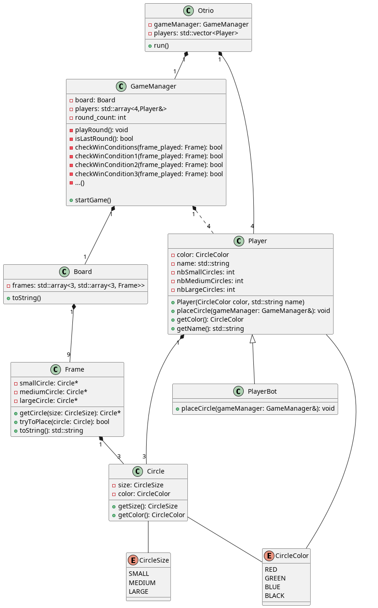
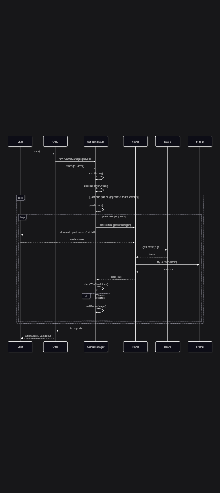

# Documentation TP6 Otrio

## Vue d'ensemble
Notre projet propose une version console du jeu Otrio, conçue pour être simple à comprendre et facile à faire évoluer grâce à une séparation claire entre le plateau, la logique de jeu et l'affichage.

## Diagramme de classes

Le code source PlantUML est disponible dans [class_diagram.puml](class_diagram.puml).

## Diagramme de séquence

Le diagramme ci-dessous illustre le déroulement d'une partie, de l'initialisation jusqu'à la victoire.

## Détails des classes et choix d'implémentation

### Board, Frame, Circle
On a choisi de regrouper les 9 cases du plateau dans un tableau fixe pour accéder directement à n'importe quelle position. Chaque Frame stocke explicitement ses 3 cercles (petit, moyen, grand), ce qui évite les erreurs d'index et simplifie les vérifications de victoire. Circle encapsule la taille et le propriétaire pour faciliter l'affichage et les tests.

### Player et PlayerBot
Player garde 3 compteurs d'anneaux restants par taille, ce qui évite des recherches inutiles et permet d'afficher l'inventaire facilement. PlayerBot hérite de Player et applique une stratégie simple (priorité aux coups gagnants, sinon blocage adverse), réutilisant ainsi tout le code existant.

### GameManager et Otrio
GameManager s'occupe du cycle de jeu : tours, vérifications de victoire et fin de partie. Otrio expose l'interface publique et coordonne les modules. Cette séparation permet d'ajouter une nouvelle interface sans toucher à la logique interne.

## Interaction et affichage

### Menu, DisplayUtils, ANSI
Menu gère les choix utilisateur via des callbacks séparés pour rester testable. DisplayUtils formate le plateau et les inventaires en texte. Les codes ANSI sont isolés dans un en-tête dédié pour pouvoir désactiver les couleurs facilement.

## Tests
Des tests unitaires couvrent Board, Frame, GameManager et le bot pour valider les comportements essentiels. 
Pour la partie graphique (menus et gameplay), les tests unitaires sont compliqués. Afin de la tester, il faut:
- Vérifier toutes les options dans le menu principal:
    - Exit
    - Help
    - Game Mode: Changement du mode de jeu (doit suprimer les joueurs en trop pour le TwoPlayer mode)
    - Add/Remove player: Même nom
    - Play: Jouer au jeu (enter des coordonnées invalides : 2A, djjs, ... ; ou emplacement incorrect: circle déjà présent, ...)

## Évolutions possibles
- Améliorer l'IA du bot sans modifier GameManager.
- Ajouter une interface graphique en remplaçant uniquement la couche DisplayUtils/ANSI.
